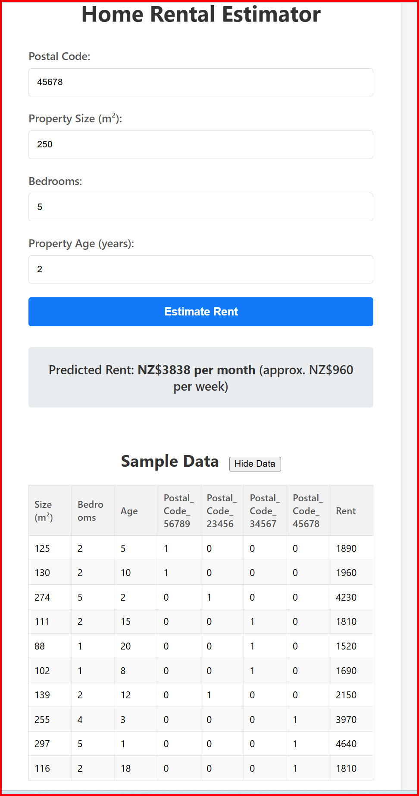

🏠 Application Components

1.  **Frontend (Client-side)**
    Responsible for the User Interface (UI) and user interactions.

    **Role**: Data input (postal code, size, number of bedrooms), data display (prediction results, sample data, model details), and handling user operations.

    **Technologies**:
    *   **HTML**: Defines the structure of the page.
    *   **CSS**: Defines the styles (appearance).
    *   **JavaScript**: Handles user interactions, manages input values, and sends requests to the backend API.

    **Image**: All elements displayed on the screen, such as dropdown menus, sliders, buttons, and result display panels, are frontend functionalities.

2.  **Backend (Server-side)**
    Responsible for data processing, machine learning model execution, and data persistence.

    **Role**:
    *   **API Provision**: Provides endpoints (URLs) to receive requests from the frontend (e.g., "Calculate rent for this property").
    *   **Machine Learning Model Hosting/Execution**: Loads the trained rent prediction model (e.g., Multiple Linear Regression model) and passes input data received from the frontend (postal code, size, number of bedrooms) to the model for prediction.
    *   **Data Management**: Manages static data such as sample data and model details, or dynamic data like user accounts in the future.

    **Technologies**:
    *   **Programming Language**: Python (Flask), Node.js (Express), C# (.NET), Java (Spring) など。
    *   **Machine Learning Libraries (for Python)**: Scikit-learn (used for implementing the Multiple Linear Regression model), Pandas (for data processing).
    *   **Web Framework**: Configures API endpoints and handles server-side logic.

⚙️ Data Flow (During Prediction)

*   **Input**: The user enters property details (e.g., 56789, 150 m², 1 bed) on the frontend (browser) and clicks the "Estimate Rent" button.
*   **Request**: The frontend JavaScript sends an HTTP request (usually a POST request) to the backend API, including the input data.
*   **Backend Processing**: The backend receives the request. Since the machine learning model was trained with property sizes in square feet (sqft), the backend first converts the input property size from square meters (m²) to sqft. Then, it passes these converted input values to the internally hosted machine learning model. The model outputs the predicted rent.
*   **Response**: The backend returns an HTTP response containing the prediction result to the frontend.
*   **Display**: The frontend receives the response and displays the predicted rent per month and an approximate rent per week, including the "NZ$" currency.

**Conclusion**: The rent prediction application functions by the collaboration of the backend, which executes the prediction logic, and the frontend, which handles user interaction.

---

## Application Demo

Here's a screenshot of the application in action:



---

## Understanding the Prediction

It's important to understand how machine learning models generate predictions and why they might differ from the raw data:

*   **Prediction vs. Actual Values**: The model provides a *prediction* based on patterns learned from the training data, not a direct lookup of exact values. The "Rent" column in the sample data represents the actual values the model learned from.
*   **Generalization**: The model aims to *generalize* patterns from the training data to make predictions for new, unseen inputs. It doesn't simply memorize the training data.
*   **Inherent Error**: Machine learning models are not perfect. There's always some degree of error or residual between the predicted value and the actual value, even for the data it was trained on. The model strives to minimize this error across the entire dataset.
*   **Input Differences**: Even if your input values are close to a row in the sample data, they might not be an exact match across all features, leading to a slightly different prediction.

---

## Model Performance and Evaluation

To assess the effectiveness of the machine learning model, various metrics are used. For this regression model, key evaluation metrics include:

*   **R-squared (Coefficient of Determination)**: This metric indicates the proportion of the variance in the dependent variable (Rent) that is predictable from the independent variables (features). An R-squared value closer to 1 suggests that the model explains a larger portion of the variance, implying a better fit to the data.
*   **Other Potential Metrics**: While R-squared provides a good overall measure, other metrics like Mean Absolute Error (MAE) or Root Mean Squared Error (RMSE) could also be used to quantify the average magnitude of the errors.

These metrics are crucial for understanding the model's accuracy and reliability. While not currently displayed in the application's UI, they are fundamental for evaluating and improving the model in a data science context.

---

## Features and Improvements

This application has been developed with the following features and improvements:

*   **Modern UI/UX**: Implemented a clean, responsive, and user-friendly interface.
*   **Data Separation**: Training data is stored in `data.csv` and excluded from version control via `.gitignore`.
*   **New Feature - Property Age**: The model now includes 'Property Age' as a feature for more accurate predictions.
*   **Robust Error Handling**: Implemented specific error messages for missing parameters, invalid input values (e.g., negative numbers), and unrecognized postal codes.
*   **Prediction Lower Bound**: Ensures that the predicted rent does not fall below a minimum value (e.g., NZ$100) to prevent unrealistic negative predictions.
*   **Unit Conversion**: Frontend input for property size is in square meters (m²), which is then converted to square feet (sqft) in the backend for model prediction.
*   **Clear Rent Display**: Predicted rent is displayed both per month and as an approximate per week value, including the "NZ$" currency, for better clarity.
*   **Sample Data Toggle**: Added a toggle button to show/hide the sample data table, improving UI cleanliness.
*   **Error Fixes**: Resolved various errors encountered during development, including `NameError` and `FileNotFoundError`.

---

## Setup and Deployment

This section provides instructions for running the application locally or deploying it to a hosting platform.

### Prerequisites

*   Python 3.x
*   pip (Python package installer)
*   Git
*   Heroku CLI (optional, for Heroku deployment)

### Local Setup

1.  **Clone the repository**:
    ```bash
    git clone https://github.com/takashim0101/Home-Rental-Estimator.git
    cd Home-Rental-Estimator
    ```

2.  **Create and activate a virtual environment**:
    ```bash
    python -m venv venv
    # On Windows
    .\venv\Scripts\activate
    # On macOS/Linux
    source venv/bin/activate
    ```

3.  **Install dependencies**:
    ```bash
    pip install -r requirements.txt
    ```

4.  **Run the application**:
    ```bash
    python -m flask run
    ```
    Access `http://127.0.0.1:5000/` in your browser.

### Deployment Alternatives

#### Heroku (Requires Account Verification with Payment Information)

1.  **Heroku CLI Installation and Login**:
    Install the Heroku CLI from [Heroku Dev Center](https://devcenter.heroku.com/articles/heroku-cli) and log in:
    ```bash
    heroku login
    ```

2.  **Install Gunicorn and update requirements.txt**:
    ```bash
    pip install gunicorn
    pip freeze > requirements.txt
    ```

3.  **Create a Procfile**:
    Create `Procfile` in the root directory with:
    ```
    web: gunicorn app:app
    ```

4.  **Initialize Git and Commit**:
    ```bash
    git init
    git add .
    git commit -m "Initial commit"
    ```

5.  **Create Heroku App**:
    ```bash
    heroku create <your-app-name>
    # Or auto-generate name
    heroku create
    ```

6.  **Deploy to Heroku**:
    ```bash
    git push heroku main
    ```

7.  **Verify Application**:
    ```bash
    heroku open
    ```

#### Replit (Recommended for Free Hosting without Payment Info)

1.  **Sign Up on Replit**: Go to [Replit.com](https://replit.com/) and sign up.

2.  **Create New Repl**: Click "Create Repl", select "Python" template.

3.  **Upload Project Files**: Drag and drop your project files (`app/`, `data.csv`, `requirements.txt`, `Procfile`) into the Repl's file tree.

4.  **Install Dependencies**: Replit usually auto-installs from `requirements.txt`. If not, run `pip install -r requirements.txt` in the shell.

5.  **Configure Run Command**: Edit the `.replit` file (if needed) to `run = "gunicorn app:app"` or modify `main.py` to run the Flask app directly:
    ```python
    from app import app
    import os

    if __name__ == '__main__':
        port = int(os.environ.get("PORT", 8080))
        app.run(host='0.0.0.0', port=port)
    ```

6.  **Run Application**: Click the "Run" button. Your app will appear in the Webview.
